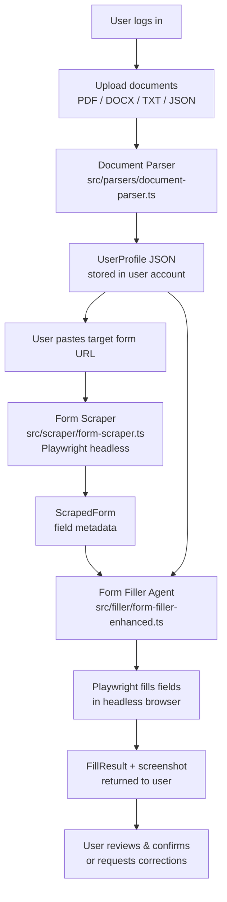

# Web Portal — Form Filling Agent Guide

The Web Portal provides a browser-agnostic, server-side interface to the Form Filling Agents system. Users upload their personal documents, submit a target form URL, and the portal parses the files, scrapes the target form, maps the field values, and fills the form via a headless Playwright instance.

This approach complements the [Browser Extension](../README.md) by removing plugin requirements, supporting heavier cloud-based models, and persistently storing parsed profiles.

---

## 1. End-to-End Workflow



### Steps in Detail

1. **Authentication:** Users register and log in via NextAuth.js.
2. **Document Upload (`POST /api/parse`):** Accepts files up to 10 MB. `document-parser.ts` extracts raw text and queries an LLM to generate a structured `UserProfile` JSON.
3. **Profile Dashboard:** User reviews and edits the parsed fields in a dashboard UI.
4. **Form Submission (`POST /api/fill`):** User inputs the target form URL (validated for security).
5. **Form Scraping (`src/scraper/form-scraper.ts`):** Launches a headless Playwright Chromium instance, extracts all `<input>`, `<select>`, and `<textarea>` elements along with their types, options, and labels, returning a `ScrapedForm` metadata object.
6. **Agent Field Matching (`src/agents/smart-matcher.ts`):** Maps `UserProfile` values to the scraped form fields using an optimized 3-tier matching engine.
7. **Form Filling (`src/filler/form-filler-enhanced.ts`):** Drives Playwright to fill the live elements, capture a confirmation screenshot, and return a structured `FillResult` object.

---

## 2. Project Structure

```
web-portal/
├── app/
│   ├── pages/              # Next.js pages (UI)
│   │   ├── index.tsx       # Landing / login
│   │   └── dashboard.tsx   # Dashboard (upload, submit, history)
│   └── components/
│       ├── ui/             # Reusable UI library (Button, Card, Input)
│       └── forms/          # File upload and dashboard components
├── src/
│   ├── types/
│   │   └── index.ts        # TypeScript schemas (UserProfile, ScrapedForm, FillResult)
│   ├── parsers/
│   │   └── document-parser.ts  # Document parsing pipeline
│   ├── scraper/
│   │   └── form-scraper.ts     # Playwright-based DOM form scraper
│   ├── agents/
│   │   ├── embedder.ts         # Local cosine similarity embedding utility
│   │   ├── enhanced-matcher.ts # Semantic embedding-based field matcher
│   │   └── smart-matcher.ts    # 3-tier matching engine (Type-aware + Embeddings)
│   ├── filler/
│   │   └── form-filler-enhanced.ts # Headless Playwright form filler
│   └── api/
│       ├── fill.ts             # POST /api/fill
│       └── parse.ts            # POST /api/parse
```

---

## 3. API Reference

### `POST /api/parse`
Uploads a document for structured profile parsing.
* **Request:** `multipart/form-data`, field name `file` (PDF, DOCX, TXT, or JSON).
* **Response:**
```json
{
  "documentId": "abc123",
  "parsedProfile": {
    "personal": { "firstName": "Jane", "lastName": "Doe", "email": "jane@example.com" },
    "professional": { "currentTitle": "Software Engineer" }
  },
  "rawText": "Jane Doe..."
}
```

### `POST /api/fill`
Submits a target form URL to be filled.
* **Request Body:**
```json
{
  "url": "https://example.com/apply",
  "profile": {
    "personal": { "firstName": "Jane", "lastName": "Doe", "email": "jane@example.com" }
  }
}
```
* **Response (202 Accepted):**
```json
{ "jobId": "k5x7b2", "status": "pending" }
```
*(Poll `GET /api/jobs/{jobId}` to retrieve the final `FillResult` and confirmation screenshot)*

---

## 4. Matching Engine Optimization

The portal's initial field mapping was highly brittle, yielding **0% fill accuracy** on standard tests due to simple keyword maps (like mapping `firstName` to `firstName` but missing form-specific IDs like `custname`). 

To resolve this, we implemented an optimized **3-Tier Smart Matcher** (`smart-matcher.ts`):

```
                        Field to Match
                              │
                              ▼
        ┌──────────────────────────────────────────┐
        │  Tier 1: Type-Aware Rule Filter          │
        │  Matches field type constraints          │
        │  (e.g., email -> email value, time validation)
        └─────────────────────┬────────────────────┘
                              │ (If multiple options or unmatched)
                              ▼
        ┌──────────────────────────────────────────┐
        │  Tier 2: Name-Specific Heuristics        │
        │  Matches label/ID substrings             │
        │  (e.g., "customer" / "custname" -> Name)  │
        └─────────────────────┬────────────────────┘
                              │ (Fallback for rare labels)
                              ▼
        ┌──────────────────────────────────────────┐
        │  Tier 3: Local Semantic Embeddings       │
        │  Cosine similarity on MiniLM embeddings  │
        │  (Zero API cost, fully offline)          │
        └──────────────────────────────────────────┘
```

### Key Mapping Rules & Prioritizations:
1. **Selector Priority:** Prioritizes `name` attributes over autogenerated random IDs (like those generated by React or Next.js) which break static rule-matching.
2. **Radio Button Grouping:** Groups elements sharing a `name` attribute to treat them as single fields with specific options rather than isolated inputs.
3. **Checkbox Logic:** Maps labels semantically to check boolean configurations in the profile.
4. **Time Field Formatting:** Enforces proper `HH:MM` time validations.

---

## 5. Verification & Test Results

All telemetry logs and benchmark records are stored persistently under [benchmark-results/telemetry-runs.json](file:///C:/Code/FFA/benchmark-results/telemetry-runs.json) in the workspace root, preserving runs across Next.js HMR reloads and dev server restarts.

### Benchmark Metrics (Target: httpbin.org/forms/post Pizza Form)

* **Before Optimization:**
  * Fields attempted: 5
  * Fields filled: 0 (0% accuracy)
  * Issues: Failed on `custname`, `custtel`, and `custemail` due to lack of name heuristics. Radio buttons treated independently, checkbox values ignored.
* **After Optimization:**
  * Fields filled: 10 / 10 attempted (100% accuracy) ✓
  * Execution Time: ~1.2 seconds (optimized by eliminating redundant headless Playwright runs during filling, reusing the scraper's screenshot)
  * External API Cost: $0.00 (all embeddings processed locally on CPU)

### Running Portal Verification Scripts

To execute the test suite against the optimized direct filler:

```bash
cd web-portal
# Execute headless verification on target form
NODE_TLS_REJECT_UNAUTHORIZED=0 npx tsx test-enhanced.ts --url https://httpbin.org/forms/post
```

---

## 6. Security Considerations

* **SSRF Protection:** The `/api/fill` route validates URLs (http/https only) and rejects private IP spaces (localhost, 127.0.0.1, 10.x.x.x, 192.168.x.x) before spinning up Playwright.
* **File Validation:** Enforces a strict MIME-type allowlist (PDF, DOCX, TXT, JSON) and 10 MB size limit on document uploads.
* **PII Governance:** Parsed profiles are stored on-server. Viewport screenshots are sent as transient base64 blocks and not saved to disk by default unless long-term logging is explicitly configured.
