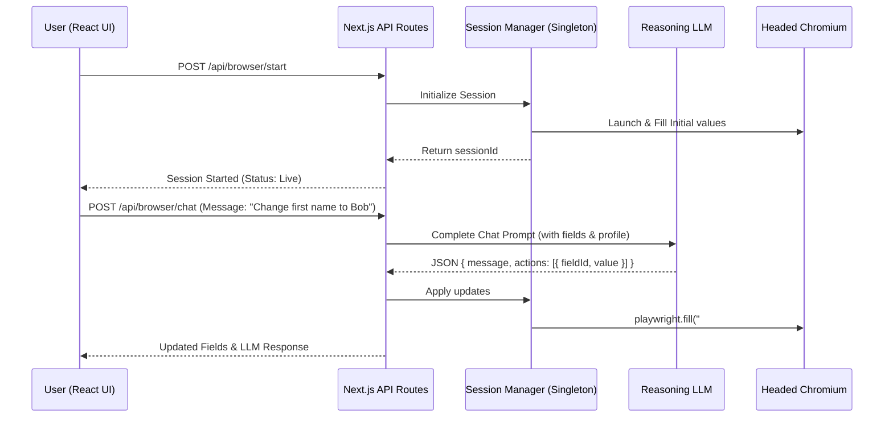

# Interactive Browser Chat with Reasoning LLM

This document explains the architectural design, API endpoints, and user interface flow for the interactive browser chat assistant feature.

## Overview

The Interactive Browser Chat allows users to converse with a reasoning LLM (such as AWS Bedrock or OpenAI) while a live, headed browser session (managed by Playwright) is active. The LLM can interpret user instructions, answer questions about the form, and execute real-time modifications directly inside the open browser window.



---

## Architecture & Session Management

### Global Registry (`session-manager.ts`)
To prevent the headed Playwright browser instance from being orphaned or terminated between HTTP requests in Next.js, we store active browser contexts in a global registry:
- **Registry Location**: [session-manager.ts](file:///C:/Code/FFA/web-portal/src/browser/session-manager.ts)
- **Data Model**:
  ```typescript
  export interface BrowserSession {
    browser: Browser;
    context: BrowserContext;
    page: Page;
    formUrl: string;
    fields: Array<{ fieldId: string; value: string; type: string; label?: string }>;
  }
  ```

---

## API Endpoints

### 1. Start Session
- **Route**: `POST /api/browser/start`
- **Payload**:
  ```json
  {
    "runId": "string",
    "formUrl": "string",
    "fields": [
      { "fieldId": "string", "value": "string", "type": "string", "label": "string" }
    ]
  }
  ```
- **Description**: Launches headed Chromium, navigates to the target form, fills it with the initial field states, and maps the session to the `runId`.

### 2. Chat with Assistant
- **Route**: `POST /api/browser/chat`
- **Payload**:
  ```json
  {
    "runId": "string",
    "message": "string",
    "history": [
      { "role": "user" | "assistant", "content": "string" }
    ]
  }
  ```
- **Response**:
  ```json
  {
    "success": true,
    "message": "LLM response text",
    "actions": [
      { "fieldId": "string", "value": "string" }
    ],
    "fields": [ ... ]
  }
  ```
- **Description**: Sends context to the reasoning LLM. Actions returned by the LLM are automatically run on the Playwright `page` instance for that session and state is synchronized.

### 3. Sync Manual Edits
- **Route**: `POST /api/browser/sync-field`
- **Payload**:
  ```json
  {
    "runId": "string",
    "fieldId": "string",
    "value": "string"
  }
  ```
- **Description**: Immediately executes value updates on the headed browser page when the user manually edits inputs in the UI Review table.

### 4. Stop Session
- **Route**: `POST /api/browser/stop`
- **Payload**:
  ```json
  {
    "runId": "string"
  }
  ```
- **Description**: Safely closes the browser window and purges the session from memory.

---

## Configuration

The assistant respects the LLM configurations defined in your environment variable files (`.env`):
- `LLM_PROVIDER`: `bedrock` or `openai`
- `LLM_MODEL`: ID of the target model (e.g. `qwen.qwen3-235b-a22b-2507-v1:0` or `gpt-4o-mini`)
