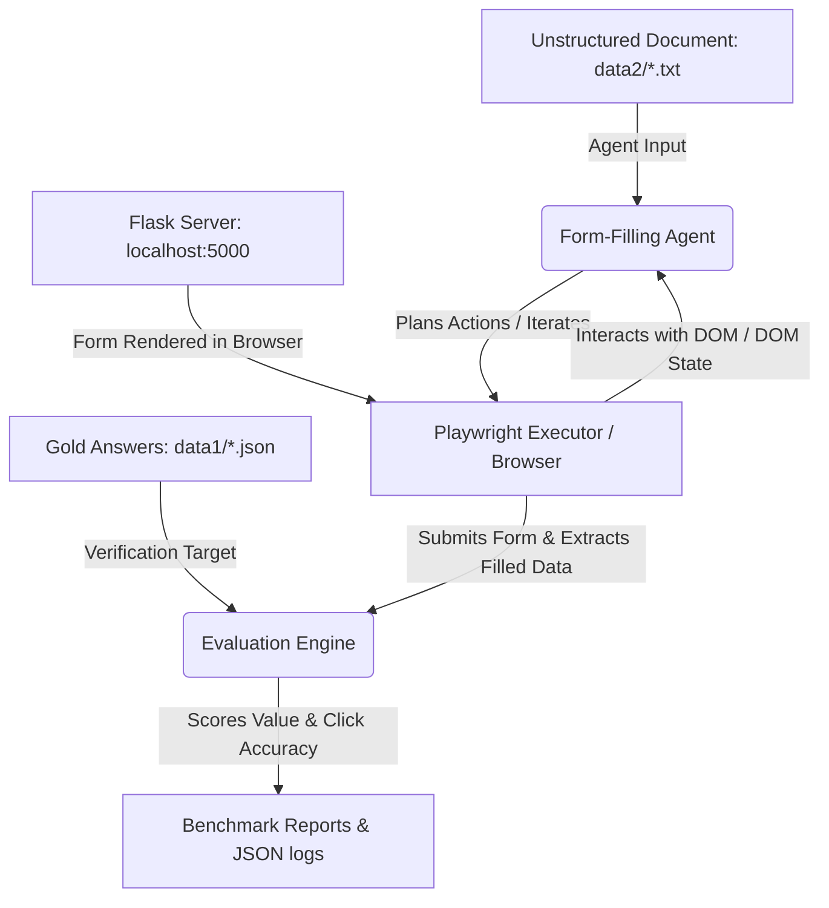

# Form-Filling Agent: End-to-End Pipeline & Concepts Explanation

This document provides a detailed walkthrough of the form-filling automation pipeline and clarifies the differences, roles, and connections between the various technologies used (Playwright, MCP, BrowserMCP, Reasoning LLMs, and Semantic Matching).

---

## 1. End-to-End Pipeline Flow

Below is the complete sequence of events when running a form-filling benchmark or live execution:

### Detailed Sequence
1. **Input Payload**: The pipeline loads an unstructured `inputDocument` (e.g., a candidate resume, bug description, or company profile) and the corresponding `goldAnswers` (the target answer values for fields).
2. **Target Web Form**: A local Flask server renders the target form (e.g., a job application, loan application, or bug report) on `http://localhost:5000`.
3. **Agent Action Planning**:
   - **Batch Agents** (Rule-Based, LLM-Structured, Embedding-Matcher) read the input document and pre-plan a list of fills (`AgentAction[]`) statically without a live browser loop.
   - **Iterative Agents** (MCP, Vision, VLM, Hybrid) attach directly to the browser session, view the page state turn-by-turn (screenshot or DOM tree), and dynamically choose actions based on what is active on screen.
4. **Automation Execution**: Playwright opens a browser, navigates to the form page, maps the planned actions to actual HTML selectors (IDs, names, labels), clicks/types/checks elements, and clicks **Submit**.
5. **Evaluation**: The evaluator extracts what was submitted in the browser, compares it against the ground-truth `goldAnswers`, and calculates value accuracy, click accuracy, and form completion rates.

---

## 2. Technology Glossary & Differences

Understanding the core components of the codebase:

| Component | What it is | Role in this Project | Why we use it |
| :--- | :--- | :--- | :--- |
| **Playwright** | Browser automation library for Node.js. | Directly drives the headless/headed browser, clicks elements, fills inputs, and submits forms. | Replaces fragile coordinate-based clicking (like PyAutoGUI in the original paper) with robust DOM selectors. |
| **Reasoning LLM** | Large Language Model (e.g. Gemma 32B, GPT-4o). | The **Cognitive Brain** that reads the unstructured document and extracts key/value mappings. | Forms have complex, diverse phrasing. LLMs reason about language context (e.g., identifying that "DOB: 12/10" means "Date of Birth"). |
| **Model Context Protocol (MCP)** | Open-standard protocol for connecting LLMs to tools. | Provides a standardized API contract for agents to call external code/tools. | Simplifies giving the LLM secure access to files, databases, or terminal environments. |
| **BrowserMCP** | A specific MCP server implementing browser toolsets. | Exposes standard browser APIs (like `click_element`, `type_text`, `get_dom`) as MCP tools for the LLM to call. | Allows the LLM to drive the browser *iteratively* on live sites, bypassing the benchmark-specific runner harness. |

---

## 3. How the Pieces Fit Together

### Playwright vs. BrowserMCP
- **Playwright** is a **developer tool** for programmatically writing browser actions in code (e.g., `page.click('#submit')`). It executes instructions directly and linearly.
- **BrowserMCP** is an **LLM tool** adapter. Instead of you writing Playwright code, BrowserMCP runs in the background and gives a Reasoning LLM tools (e.g., `click_element`). The LLM reads the page layout, chooses to call the `click_element` tool, and the BrowserMCP server executes it on the browser.

### Where does the Reasoning LLM fit in?
The LLM does the heavy lifting of parsing unstructured inputs.
- In **LLM Structured Output Agent**, the LLM maps all keys at once:
  $$\text{Input Document} + \text{Form Fields} \xrightarrow{\text{Reasoning LLM}} \text{JSON Mapping} \xrightarrow{\text{Playwright}} \text{DOM Fills}$$
- In **Vision / VLM Agents**, the LLM acts as both parser and locator:
  $$\text{Viewport Screenshot} + \text{Input Document} \xrightarrow{\text{Multimodal LLM}} \text{Click Coordinate + Text Actions} \xrightarrow{\text{Playwright Mouse}} \text{DOM Fills}$$

### Where does Semantic Matching come in?
Semantic matching maps the unstructured information from the document to the corresponding field labels in the form.
For example, if the document has:
> *"My name is John M. Smith"*

And the form contains a text input labeled:
> `[ First Name ]`

Semantic matching connects the label `"First Name"` to the value `"John"`. It can be performed by:
1. **Rule-Based Regex**: Matches literal string structures (fast, free, offline).
2. **Dense Vector Embeddings (Cosine Similarity)**: Converts labels and candidate texts into vectors using an embedding model (like Xenova/all-MiniLM-L6-v2), and pairs the most semantically similar labels (e.g., "Full Name" matches "Applicant Name").
3. **Structured LLM outputs**: Letting a reasoning model generate the mapping using prompt guidelines.
