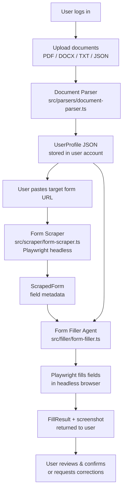

# Web Portal — Form Filling Agent

**Last updated:** 2026-05-26
**Status:** In progress — scaffold complete, agent logic stubs in place.

---

## Purpose

The Web Portal provides a browser-agnostic, server-side interface to the Form Filling Agents system. Users log in, upload their personal documents, and submit any URL. The portal scrapes the form at that URL, maps the user's stored profile onto the fields, fills the form via a headless browser, and returns a confirmation with a screenshot.

This approach complements the [Browser Extension](../extension/README.md):
- No browser plugin required
- Supports heavier / cloud-based agent models
- Stores user data persistently (documents, profiles, fill history)
- Accessible from any device

---

## End-to-End Workflow



### Steps in detail

1. **Authentication** — Users register / log in (NextAuth.js). Session token passed on all API calls.

2. **Document Upload** (`POST /api/parse`)
   - Accepts PDF, DOCX, TXT, or JSON files (max 10 MB).
   - `document-parser.ts` extracts raw text (pdf-parse / mammoth), then calls an LLM with a structured-output prompt to produce a `UserProfile` JSON.
   - The parsed profile is stored against the user account. Multiple documents can be uploaded; profiles are merged.

3. **Profile Review & Edit** (Dashboard UI)
   - User sees parsed fields (name, email, address, skills, etc.) in an editable form.
   - Corrections are saved back to the stored `UserProfile`.

4. **Submit a URL** (`POST /api/fill`)
   - User provides the URL of a form they want to fill (e.g., a job application, grant form, event registration).
   - URL is validated (http/https only, no internal/localhost targets).

5. **Form Scraping** (`src/scraper/form-scraper.ts`)
   - A Playwright Chromium browser opens the URL in headless mode.
   - All `<input>`, `<select>`, and `<textarea>` elements are extracted with their labels, names, types, and options.
   - Returns a `ScrapedForm` object.

6. **Agent Fill** (`src/filler/form-filler.ts`)
   - The active agent strategy (currently: rule-based keyword matching, same logic as the extension's `rule-based` agent) maps `UserProfile` fields to `ScrapedForm` fields.
   - Playwright types/clicks/selects values into the live page.
   - A screenshot is captured for confirmation.

7. **Result Review**
   - `FillResult` is returned: fields filled, fields skipped (with reasons), screenshot.
   - User can optionally trigger a real submission or download the filled data as JSON.

---

## Project Structure

```
web-portal/
├── app/
│   ├── pages/              # Next.js pages (UI)
│   │   ├── index.tsx       # Landing / login
│   │   └── dashboard.tsx   # Main dashboard (upload docs, submit URL, view history)
│   └── components/
│       ├── ui/             # Generic UI components (Button, Input, Card…)
│       └── forms/          # Portal-specific form components
│           ├── DocumentUpload.tsx
│           ├── ProfileEditor.tsx
│           └── FillJobForm.tsx
├── src/
│   ├── types/
│   │   └── index.ts        # All TypeScript types (User, UserProfile, ScrapedForm, FillJob…)
│   ├── parsers/
│   │   └── document-parser.ts  # PDF/DOCX/TXT/JSON → UserProfile
│   ├── scraper/
│   │   └── form-scraper.ts     # URL → ScrapedForm (Playwright)
│   ├── filler/
│   │   └── form-filler.ts      # ScrapedForm + UserProfile → FillResult (Playwright)
│   └── api/
│       ├── fill.ts             # POST /api/fill
│       └── parse.ts            # POST /api/parse
├── next.config.js
├── tsconfig.json
└── package.json
```

---

## API Reference

### `POST /api/parse`
Upload a document for parsing.

**Request:** `multipart/form-data`, field name `file`.
Accepted MIME types: `application/pdf`, `application/vnd.openxmlformats-officedocument.wordprocessingml.document`, `text/plain`, `application/json`.

**Response:**
```json
{
  "documentId": "abc123",
  "parsedProfile": {
    "personal": { "firstName": "Jane", "lastName": "Doe", "email": "jane@example.com" },
    "professional": { "currentTitle": "Software Engineer", "company": "Acme Corp" }
  },
  "rawText": "Jane Doe — Software Engineer..."
}
```

---

### `POST /api/fill`
Submit a URL for form filling.

**Request body:**
```json
{
  "url": "https://example.com/apply",
  "profile": {
    "personal": { "firstName": "Jane", "lastName": "Doe", "email": "jane@example.com" }
  }
}
```

**Response (202 Accepted):**
```json
{ "jobId": "k5x7b2", "status": "pending" }
```

Poll `GET /api/jobs/{jobId}` for the completed `FillResult`.

---

## Technology Choices

| Component | Choice | Rationale |
|-----------|--------|-----------|
| Web framework | Next.js 14 | Same stack as extension UI; SSR + API routes in one package |
| Headless browser | Playwright (Chromium) | Robust DOM automation, already used in extension benchmark |
| Document parsing | pdf-parse + mammoth + LLM | Rule-based extraction is fragile; LLM gives generalizable results |
| Auth | NextAuth.js | Flexible providers (email, OAuth); integrates with Next.js natively |
| Styling | Tailwind CSS | Already in use across the project |
| Storage | File system (MVP) → DB | JSON files for MVP; swap to PostgreSQL/Supabase for production |

---

## Security Considerations

- **SSRF protection:** `fill.ts` validates URL protocol (http/https only) and rejects localhost/private ranges before launching Playwright.
- **File upload validation:** `parse.ts` enforces MIME type allowlist and 10 MB size cap before reading buffers.
- **PII handling:** Parsed profiles stay server-side. Screenshots are base64 in the API response and not persisted by default. Users must opt in to long-term storage.
- **Auth on all routes:** All `/api/*` routes (except health-check) must validate the NextAuth session token.
- **API keys:** Never stored in code; loaded from environment variables. See `.env.example` in `web-portal/`.

---

## Development Roadmap

### Phase 1 — Core Pipeline (current)
- [x] Scaffold folder structure and type definitions
- [x] `document-parser.ts` stub (LLM extraction TODO)
- [x] `form-scraper.ts` — Playwright-based field extractor
- [x] `form-filler.ts` — rule-based agent + Playwright executor
- [x] API routes: `/api/fill`, `/api/parse`
- [ ] NextAuth setup (email provider)
- [ ] Basic dashboard UI (upload + submit URL)

### Phase 2 — Document Intelligence
- [ ] Implement PDF extraction (pdf-parse)
- [ ] Implement DOCX extraction (mammoth)
- [ ] LLM structured-output profile extraction (GPT-4o / Llama local)
- [ ] Profile editor UI with field-by-field review

### Phase 3 — Agent Upgrade
- [ ] Port `embedding-matcher` agent strategy to portal server
- [ ] Port `llm-structured` agent strategy to portal server
- [ ] Job queue (BullMQ or simple queue) for async fill jobs
- [ ] Fill history + replay

### Phase 4 — Production Hardening
- [ ] Swap file-system storage for PostgreSQL / Supabase
- [ ] SSRF blocklist for private IP ranges
- [ ] Rate limiting on `/api/fill` and `/api/parse`
- [ ] Opt-in telemetry and error reporting

---

## Quick Start

```bash
cd web-portal
npm install
cp .env.example .env.local   # fill in NEXTAUTH_SECRET, OPENAI_API_KEY etc.
npm run dev                  # starts on http://localhost:3001
```

---

## Relationship to the Extension

The extension and portal share the same core concept — a `UserProfile` JSON is the single input to all fill agents. The mapping strategies in `web-portal/src/filler/` will be kept in sync with the implementations in `extension/src/implementations/`. When an agent strategy matures in the extension benchmark, it is promoted to the portal.

See [Documentation/Brainstorm.md](Brainstorm.md) for the full list of implementation options and rationale.
